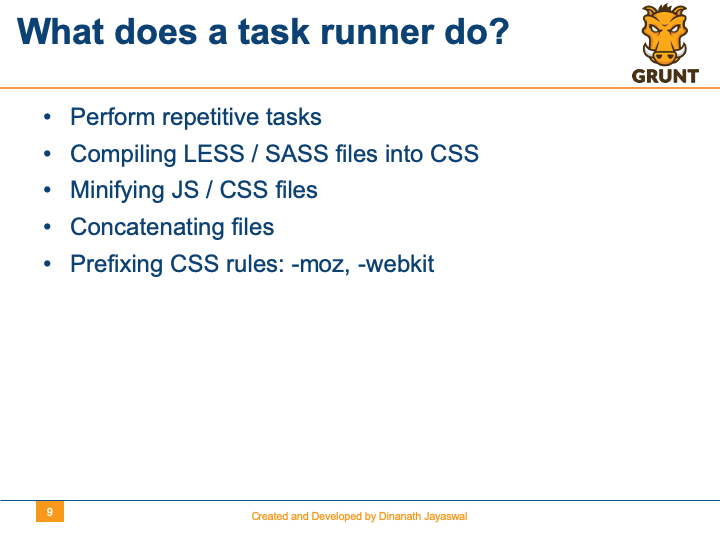
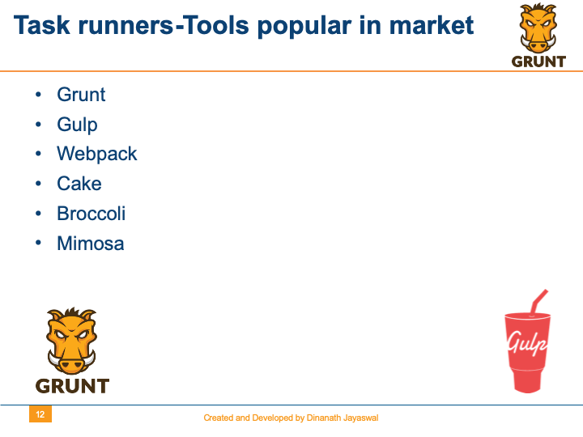

> **Description**:

In this course, let us learn and use Grunt-the JavaScript Task Runner, which helps to Architect, Practice, and Automate your development workflow so we can build app/projects/websites faster.

Grunt is a command-line task automation tool that speeds up development workflow by taking all the repetitive `grunt work` out of work.

> **Topics (separate with spaces)**:

Add topics to categorize your repository and make it more discoverable.

- grunt
- grunt-javascript-task-runner
- grunt-cli
- grunt-task
- gruntjs
- gruntfile-gruntfilejs
- grunt-configuration
- grunt-plugins
- grunt-gulp-webpack
- grunt-automate-development-workflow
- grunt-uglify
- grunt-cssmin
- grunt-htmlmin
- grunt-imagemin
- grunt-sass
- grunt-concat
- grunt-contrib
- grunt-source-to-target-copy
- grunt-watch
- grunt-node-npm-package

 

 

Grunt - The JavaScript Task Runner
=====================
Automate Workflow with Grunt
=====================

- Grunt is a `task-based` command line build tool for JavaScript projects
- Grunt JS is a `JavaScript task automation tool` which make life better/easier
- Grunt is a command-line task automation tool that speeds up development workflow by taking all the repetitive `grunt work` out of work

> `Grunt` is a `JavaScript Task Runner` which can be used as a `command-line tool` for JavaScript objects, It is a `task manager` written on top of `NodeJS`, helps to automate front end workflow to Build app/project/websites faster.

Welcome
---------------------

Hi All, I'm **`Dinanath Jayaswal, Senior UI/Web Developer and Adobe Certified Expert Professional`**, I wanna welcome you to `Grunt - The JavaScript Task Runner (Automate Workflow with Grunt)` tutorial for all. 

About the Course/Tutorial
---------------------

In this course, let us learn and use Grunt-the JavaScript Task Runner, which helps to Architect, Practice, and Automate your development workflow so we can build app/projects/websites faster.

Grunt is a command-line task automation tool that speeds up development workflow by taking all the repetitive `grunt work` out of work.

What will learn and cover
---------------------

Welcome to the new tutorial series on `Grunt - The JavaScript Task Runner (Automate Workflow with Grunt)`.

In this introductory Angular Material module will have a look and learn:
- Understand what is Grunt, How to install/setup and use Grunt
- Use Grunt to automate everyday development tasks

Who is this for? Audience
---------------------

This Course/Tutorial is ideal for:
- Freshers
- Intermediates
- Web Designers and Developers, Front-End/UI Designers and Developers
- Developer who wants to configure Grunt efficiently for project
- An architect who wants to industrialize automation, or just want to move repetitive tasks away
- Any coder looking to be more efficient when programming or developing with JavaScript
- Candidates desire to learn new techniques to improve skills
- Anyone want to be more productive writing/using with JavaScript libraries and external utilities
- Front-end developer who wants to streamline the development workflow with an automated build system

Course/Tutorial achievement
---------------------
Course/Tutorial Goal
---------------------

After completing/attending/finishing this Course/Tutorial, participants should be able to: 
- Understand What, Why and How to use Grunt
- Install/Setup Grunt
- Minify / Concatenate / Combine files
- Generating automated Grunt Build
- Understand Best coding/programming practices for minification

Prerequisites for current course / What you need to know
---------------------

- Node / NPM
- Terminal - Unix / DOS terminal
- Participants need to know and have Basic/Intermediate knowledge of HTML/HTML5, CSS/CSS3 or JavaScript
- JavaScript (good to know - understand the basis of JavaScript)
- How to use a text editor such as Notepad++, Sublime Text and/or IDE like Visual Studio Code 
- Some programming background or Coding knowledge is preferred

Topics included/covered
=====================

1. [Introduction to Grunt](#1-introduction-to-grunt)
   - 1.1 [Grunt-The JavaScript Task Runner](#11-grunt-the-javaScript-task-runner)
   - 1.2 [Welcome](#12-Welcome)
   - 1.3 [Agenda](#13-Agenda)
   - 1.4 [What You will Learn](#14-what-you-will-learn)
   - 1.5 [General Web-UI Development Tasks](#15-General-Web-UI-Development-Tasks)
   - 1.6 [Automating Tasks-different approach](#16-Automating-Tasks-different-approach)
   - 1.7 [What is Grunt?](#17-What-is-Grunt)
   - 1.8 [Task based-Task Automation](#18-Task-based-Task-Automation)
   - 1.9 [What does a task runner do?](#19-What-does-a-task-runner-do)
   - 1.10 [Why Grunt?](#110-Why-Grunt)
   - 1.11 [Who have been using it?](#111-Who-have-been-using-it)
   - 1.12 [Task runners-Tools popular in market](#112-Task-runners-Tools-popular-in-market)
   - 1.13 [Build System around us](#113-Build-System-around-us)

1 Introduction to Grunt
=====================

1.1. Grunt-The JavaScript Task Runner
---------------------

  <figure>
    &nbsp;&nbsp;&nbsp; 
    <figcaption>&nbsp;&nbsp;&nbsp; Image - Grunt-The JavaScript Task Runner - Banner</figcaption>
  </figure>

1.2. Welcome
---------------------

  <figure>
    &nbsp;&nbsp;&nbsp; 
    <figcaption>&nbsp;&nbsp;&nbsp; Image - Grunt-The JavaScript Task Runner - Welcome</figcaption>
  </figure>

1.3. Agenda
---------------------

  <figure>
    &nbsp;&nbsp;&nbsp; 
    <figcaption>&nbsp;&nbsp;&nbsp; Image - Grunt-The JavaScript Task Runner - Agenda</figcaption>
  </figure>

1.4. What You will Learn
---------------------

  <figure>
    &nbsp;&nbsp;&nbsp; 
    <figcaption>&nbsp;&nbsp;&nbsp; Image - Grunt-The JavaScript Task Runner - What You will Learn</figcaption>
  </figure>

1.5. General Web-UI Development Tasks
---------------------

  <figure>
    &nbsp;&nbsp;&nbsp; 
    <figcaption>&nbsp;&nbsp;&nbsp; Image - Grunt-The JavaScript Task Runner - General Web-UI Development Tasks</figcaption>
  </figure>

1.6. Automating Tasks-different approach
---------------------

  <figure>
    &nbsp;&nbsp;&nbsp; 
    <figcaption>&nbsp;&nbsp;&nbsp; Image - Grunt-The JavaScript Task Runner - Automating Tasks-different approach</figcaption>
  </figure>

1.7. What is Grunt?
---------------------

  <figure>
    &nbsp;&nbsp;&nbsp; 
    <figcaption>&nbsp;&nbsp;&nbsp; Image - Grunt-The JavaScript Task Runner - What is Grunt?</figcaption>
  </figure>

1.8. Task based-Task Automation
---------------------

  <figure>
    &nbsp;&nbsp;&nbsp; 
    <figcaption>&nbsp;&nbsp;&nbsp; Image - Grunt-The JavaScript Task Runner - Task based-Task Automation</figcaption>
  </figure>

1.9. What does a task runner do?
---------------------

  <figure>
    &nbsp;&nbsp;&nbsp; 
    <figcaption>&nbsp;&nbsp;&nbsp; Image - Grunt-The JavaScript Task Runner - What does a task runner do?</figcaption>
  </figure>

1.10. Why Grunt?
---------------------

  <figure>
    &nbsp;&nbsp;&nbsp; 
    <figcaption>&nbsp;&nbsp;&nbsp; Image - Grunt-The JavaScript Task Runner - Why Grunt?</figcaption>
  </figure>

1.11. Who have been using it?
---------------------

  <figure>
    &nbsp;&nbsp;&nbsp; 
    <figcaption>&nbsp;&nbsp;&nbsp; Image - Grunt-The JavaScript Task Runner - Who have been using it?</figcaption>
  </figure>

1.12. Task runners-Tools popular in market
---------------------

  <figure>
    &nbsp;&nbsp;&nbsp; 
    <figcaption>&nbsp;&nbsp;&nbsp; Image - Grunt-The JavaScript Task Runner - Task runners-Tools popular in market</figcaption>
  </figure>

1.13. Build System around us
---------------------

  <figure>
    &nbsp;&nbsp;&nbsp; 
    <figcaption>&nbsp;&nbsp;&nbsp; Image - Grunt-The JavaScript Task Runner - Build System around us</figcaption>
  </figure>

